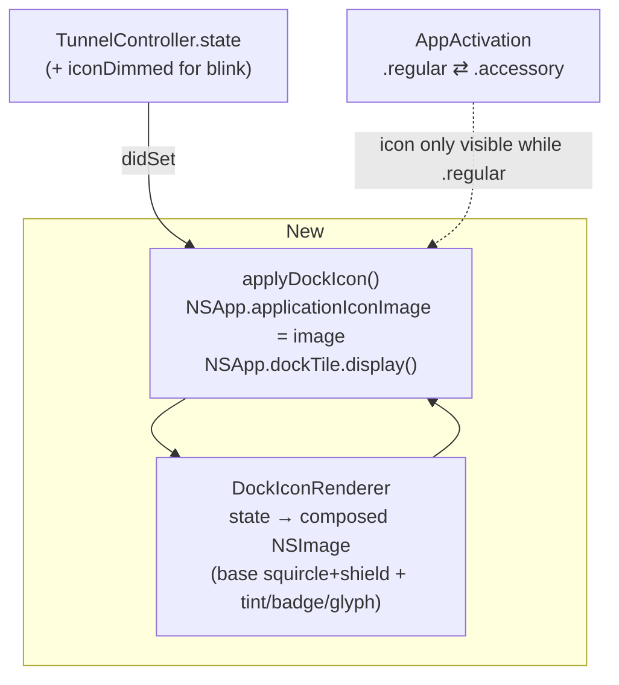

# Plan: Connection-aware Dock icon

Make the macOS **Dock** icon reflect the tunnel's connection state — a clearly
different icon when connected vs disconnected (plus connecting / reconnecting /
error). The menu-bar status item already changes per state via SF Symbols and a
blink (see [`menuBarSymbol`](../TunnelProxy/TunnelProxyApp.swift) and
[MenuBarRenderer.swift](../TunnelProxy/Controllers/MenuBarRenderer.swift)); the
Dock icon is still the single static bundle icon. This feature gives the Dock the
same at-a-glance state the menu bar already has.

## Background: when is there even a Dock icon?

The app is a menu-bar utility — `LSUIElement` is `true` in
[Info.plist](../TunnelProxy/Info.plist), so by default it runs as an *agent* with
no Dock presence. But it flips its activation policy to `.regular` whenever the
main window is open (`AppActivation.becomeRegular()` in
[UnifiedWindowView.swift:290](../TunnelProxy/Views/UnifiedWindowView.swift#L290))
and back to `.accessory` when the window closes. **So a Dock icon appears exactly
while the main window is open.** That's the window in which this feature matters.

Implication for scope: the state-tinted icon is visible during the ordinary
"window open, watching the connection" flow. When the app is a pure agent
(window closed) there is no Dock tile to tint — the menu-bar icon covers that
case and is unchanged by this plan.

## Decisions (confirmed)

| Question | Choice |
|----------|--------|
| Rendering | **Runtime-composed.** Set `NSApp.applicationIconImage` (and use `NSApp.dockTile`) from Swift on each state change. No SVG toolchain (`rsvg`/`cairosvg` aren't installed locally) and no new bundle icon sets. |
| Icon distinction | **Option A — tint + status badge.** Keep the shield artwork; recolour the canvas and add a lower-right status badge per state. |
| States covered | All five `ConnectionState` cases: `.disconnected`, `.connecting`, `.connected`, `.reconnecting`, `.error`. |

Rationale for runtime composition: the app already renders its menu-bar image
programmatically in [MenuBarRenderer.swift](../TunnelProxy/Controllers/MenuBarRenderer.swift),
so drawing an `NSImage` per state is an established pattern here. It avoids adding
four more `.appiconset`/`.icns` variants to the bundle and avoids needing a
SVG→PNG generator (none exists — [icon/](../icon/) holds only `icon.svg` +
`icon-master.png`, no build script).

## Design — Tint + status badge

*Mockup: [mockups/dock-icon-states-tint.svg](mockups/dock-icon-states-tint.svg)
(verified via QuickLook at grid layout).*

The existing shield + routing-hub artwork is kept so the icon still reads as
*this* app. The **canvas colour** and a small **status badge** in the lower-right
(macOS badge placement) change per state:

| State | Canvas | Badge |
|-------|--------|-------|
| Connected | brand blue (as today) | green ✓ |
| Disconnected | desaturated slate grey | hollow ring |
| Connecting… | amber | three dots |
| Reconnecting… | amber | circular arrow |
| Error | red | white “!” |

Reads as one app; state is obvious even at ~32 px; the badge shape carries state
independently of hue, so it survives colour-blindness. Closest to platform
convention (Messages/Mail-style corner badges).

## Architecture

State already has a `didSet` observer in
[TunnelController.swift:37](../TunnelProxy/Controllers/TunnelController.swift#L37)
(`updateBlink()`, `syncRecorderState()`, `syncLatencyProbing()`). We add one more
call — `updateDockIcon()` — to that same `didSet`, and also call it when the
activation policy flips to `.regular` (so a window opened while already connected
shows the right icon immediately).

### The blink

`iconDimmed` (a published `Bool`, [TunnelController.swift:72](../TunnelProxy/Controllers/TunnelController.swift#L72))
drives the connecting/reconnecting fade in the menu bar. For the Dock we should
**not** reuse that fast blink — a Dock tile flashing is jarring and fights macOS's
own bounce. Instead:

- Dock icon updates on `state` changes only (5 discrete images), *not* on every
  `iconDimmed` toggle.
- The "working" feel for connecting/reconnecting comes from the distinct
  connecting/reconnecting artwork (amber + spinner/dots), which is static per
  state — no animation needed. (Animating the Dock tile is possible via a timer
  redrawing `dockTile`, but it's out of scope; noted as a future extension.)

## New components

- **`DockIconRenderer`** — an `enum` (like `MenuBarRenderer`) with
  `static func image(for state: ConnectionState) -> NSImage`. Builds the composed
  icon by drawing into an `NSImage`:
  - Draw the base squircle + shield (either from the bundled `AppIcon` via
    `NSImage(named: NSImage.applicationIconName)`/`NSApp.applicationIconImage`
    captured **once at launch** before we start mutating it, or by drawing the
    shield paths directly — same geometry as [icon/icon.svg](../icon/icon.svg)).
  - Apply the per-state canvas tint + lower-right status badge (Option A).
  - Cache the five results (they never change) so state churn doesn't re-draw.
  - **Not** a template image — the Dock shows full colour.
- **`updateDockIcon()`** on `TunnelController` (or a thin `DockIcon` helper) —
  reads `state`, asks `DockIconRenderer` for the image, sets
  `NSApp.applicationIconImage` and calls `NSApp.dockTile.display()`. Guarded so it
  no-ops when there is no Dock tile (activation policy `.accessory`) to avoid
  wasted work, though setting `applicationIconImage` while accessory is harmless.

### Capturing the base icon

`NSApp.applicationIconImage` is the live tile; once we overwrite it we lose the
pristine original. Capture it **at launch**, before the first state-driven update,
into a stored `let baseIcon` — or avoid the problem entirely by loading the
asset-catalog image by name (`NSImage(named: "AppIcon")`). Prefer loading by name
so restore-to-default is always available.

## Files touched / added

| File | Change |
|------|--------|
| `Controllers/DockIconRenderer.swift` | **New** — compose the per-state Dock `NSImage` (mirrors `MenuBarRenderer`'s structure). |
| `Controllers/TunnelController.swift` | Add `updateDockIcon()`; call it from `state.didSet` and once on launch. Optional `showDockStateIcon` pref (see Settings). |
| `Views/UnifiedWindowView.swift` | In `AppActivation.becomeRegular()`, refresh the Dock icon so an already-connected app shows the right icon the moment the window (and Dock tile) appears. |
| `Views/SettingsView.swift` | Toggle "Show status on Dock icon" (default **on**) in the Menu Bar tile. |
| `en.lproj` / `zh-Hans.lproj` `Localizable.strings` | New strings (settings toggle label). |
| `icon/icon.svg` + `AppIcon.appiconset` | Unchanged — the base icon stays; states are composed at runtime. (Only touched if we later pre-bake, which we're not.) |

No changes to `MenuBarRenderer` — the two renderers are independent (menu bar =
template monochrome; Dock = full colour). They can share the shield-path drawing
if we factor it out, but that's optional cleanup, not required.

## Correctness / pitfalls

1. **Only overwrite the tile while `.regular`.** Setting `applicationIconImage` is
   harmless when accessory (no tile shown), but calling `dockTile.display()`
   should be gated so we don't churn. Refresh on the `.regular` transition.
2. **Restore on quit is unnecessary** — `applicationIconImage` is per-process; it
   resets to the bundle icon next launch. No teardown needed.
3. **Retina.** Compose at the icon's full point size (draw at 1024²-equivalent and
   let `NSImage` scale, or provide multiple representations). Verify at 128/256/512
   Dock sizes — the badge must not clip at the tile's rounded corner and must stay
   legible when downscaled.
4. **Colour-blind safety.** Don't rely on colour alone — the badge shape (✓ / ring
   / dots / arrow / “!”) carries state independently of hue.
5. **Error message churn.** `.error(String)` carries a message, but the icon must
   be identical for any error string. Switch on the case, ignore the associated
   value, so distinct error messages don't thrash the icon/cache.
6. **`state.didSet` is on `@MainActor`.** `TunnelController` is `@MainActor`
   ([:33](../TunnelProxy/Controllers/TunnelController.swift#L33)) and `NSApp` calls
   are main-thread-only — the existing `didSet` already runs there, so no hop
   needed.

## Milestones

1. **Plumbing** — `DockIconRenderer` composing the tint + badge for each state;
   wire `updateDockIcon()` into `state.didSet` + launch + `becomeRegular`. Verify
   the Dock tile visibly changes on connect/disconnect.
2. **Polish** — retina/size verification at 128/256/512; Settings toggle +
   localization; edge states (rapid connect↔disconnect, error strings).

## Verification

- **State mapping:** connect → blue/connected icon; disconnect → grey/disconnected;
  kill ssh to force reconnect → amber/reconnecting; induce an auth failure →
  red/error. Confirm each transition updates the Dock tile within a frame.
- **Window-closed case:** with the main window closed (agent mode) there's no Dock
  tile — confirm no crash and that opening the window then shows the *current*
  state's icon (not a stale default).
- **Rapid toggling:** connect/disconnect quickly; confirm no flicker beyond the
  discrete image swap and no leak (cached images reused, not re-rendered).
- **Sizes:** view the Dock at small and large tile sizes; confirm the badge stays
  legible and doesn't clip the tile corner.
- **Relaunch:** quit and relaunch; confirm the icon starts at the correct state
  (disconnected on a fresh launch, or connected if auto-connect fires).

## Future extensions (out of scope now)

- **Animated Dock tile** for connecting/reconnecting (timer-driven `dockTile`
  redraw, e.g. a rotating spinner) — deliberately omitted to avoid a distracting
  Dock flash.
- **Dock badge with live info** (e.g. exit-country flag, or a data-usage count via
  `dockTile.badgeLabel`) — orthogonal to the state icon.
- **Pre-baked `.icns` per state** if we ever want pixel-perfect hinting at every
  size; would require adding an SVG→PNG generator to [icon/](../icon/).
- Sharing the shield-path drawing between `DockIconRenderer` and
  `MenuBarRenderer` as a small reusable `ShieldGlyph` if a third consumer appears.
